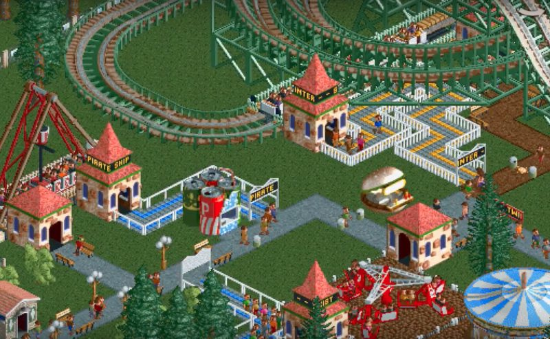

# Rollercoaster Tycoon Park Bot

This repo is a fleet of AWS Lambda functions put together to mimic Rollercoaster
Tycoon alert messages on Twitter.

## Architecture

The bots are written in Python 3.6 and deployed as AWS Lambda functions. Most
bots are configured to run on some kind of schedule, invoked by CloudWatch
events. For example, the `award` function runs every two days, while other
function run more frequently.

The most complicated set of functions is `break_ride` and `mechanic`. Every few
hours, the `break_ride` function is invoked. This function sets a CloudWatch
custom metric, `broken_rides` to 1 and tweets about a ride breaking down. A
CloudWatch alarm fires, which kicks off the `mechanic` function and sends a
corresponding tweet (in a thread) about the mechanic being dispatched. That
function also "resolves" the CloudWatch alarm, which fires off the mechanic
function again to tweet about the ride being fixed. All state, including the
tweet ID and broken ride is stored in a tiny object in an S3 bucket.

## Deployments

The functions are organized to make deployments with [apex](http://apex.run)
easy.

## Follow Along

This code is live in production (lol) at [@RCT_Park](https://twitter.com/RCT_Park)

## Kudos

All of this was inspired by [@RCTGuests](https://twitter.com/RCTGuests), and
they were nice enough to give me permission to retweet the account every so
often :raised_hands:
